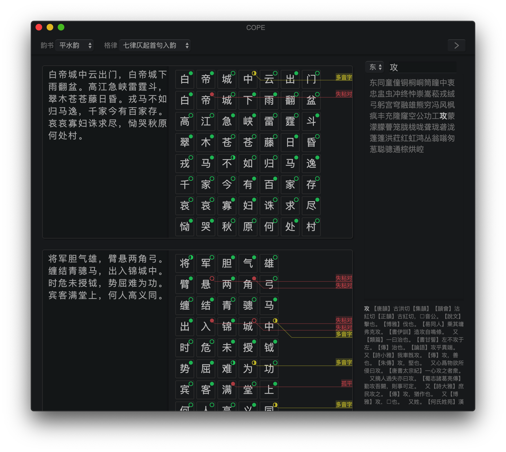
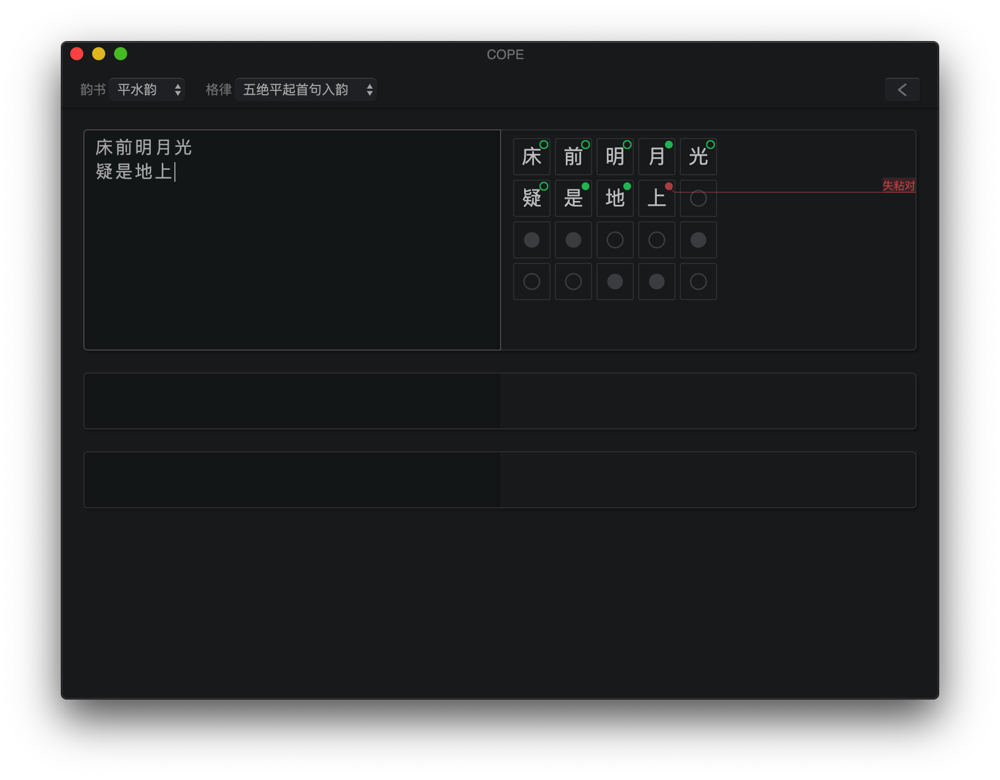
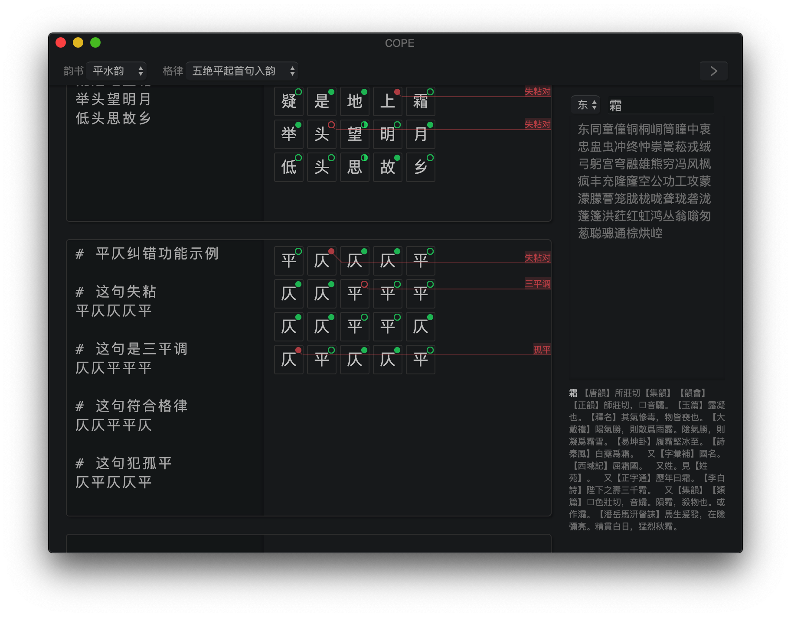
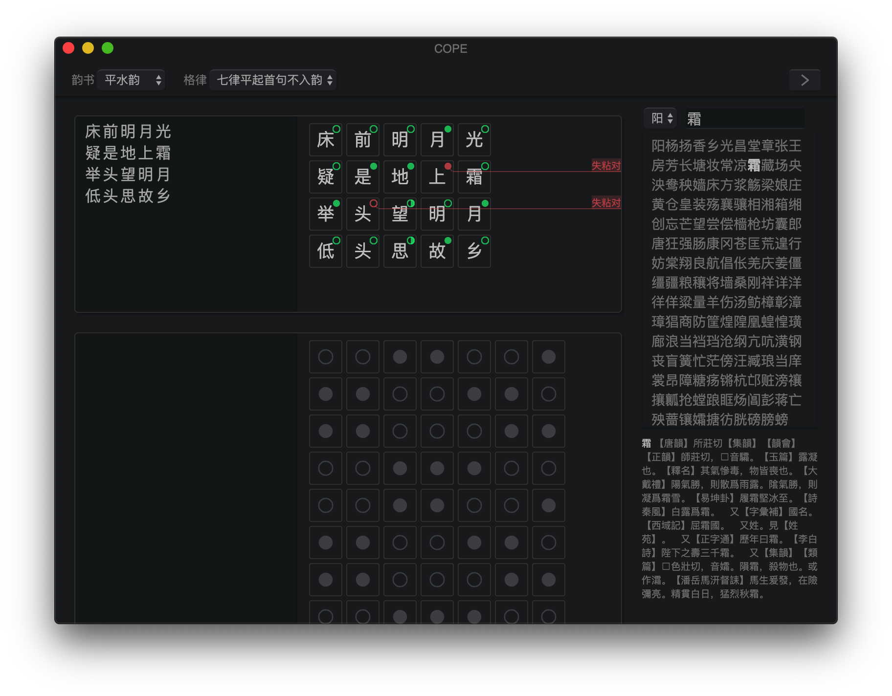
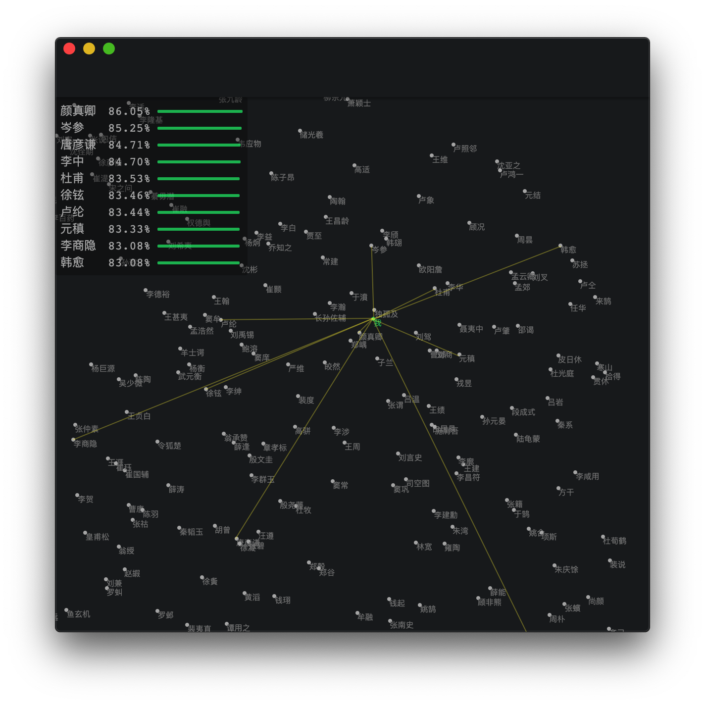
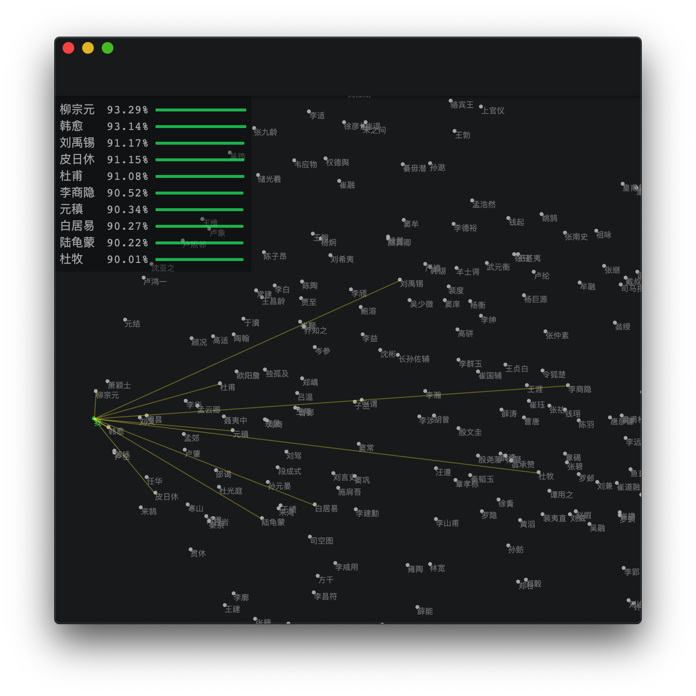
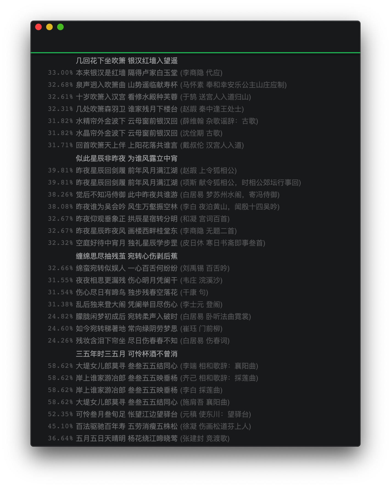

# COPE - 格律诗编辑程序
**C**hinese **O**ld **P**oem **E**ditor - An modern IDE for writing [classical Chinese poetry](https://en.wikipedia.org/wiki/Classical_Chinese_poetry).

## Features 功能

- A tool for writing, editing, and managing user poems. 一个帮助创作、编辑、管理格律诗作品的工具
- Automatically recognize [tone patterns](https://en.wikipedia.org/wiki/Tone_pattern) and detect errors. 自动检查平仄等格律规则。（失粘/失对/孤平/三平调/落韵）
- Support for all 4 variations of 5-character and 7-character [Jueju](https://en.wikipedia.org/wiki/Jueju) and [Lüshi](https://en.wikipedia.org/wiki/Lüshi_(poetry)). 支持五七律绝的四种变格。
- Built-in dictionaries. 内置韵书（平水韵/中华新韵）及康熙字典
- Provide insights into user poems using data analysis. 机器学习分析用户作品并与《全唐诗》唐人诗句比对。

## Installation 安装

### Binaries

For macOS and Windows binaries, download the latest version on [Releases]() page. [下载链接]()

### Building

First, install [node.js](https://nodejs.org/en/download/), including npm.

`cd` into the project directory, and type `npm install`. This will install all the dependencies.

Finally, `npm start` to run the app.

## Usage 使用

|              |   |
:-------------------------:|:-------------------------:
  |  Click on left side of a cell to edit its contents. The tonal pattern hints will be shown on the right. Select rhyming dictionary and verse form from the tool bar. New cells will be automatically added once you filled up empty cells, or, you can manage them by clicking `Cells` from the menu bar. Add comments/title/attribution to your poem by preceding a line with a octothorpe (`#`).
  |  Before you fill in a character, it's correct tonal pattern is shown on the right in the corresponding position. After you do so, a color-coded icon is shown on the upper right corner, indicating the tonal pattern of the character, and whether it is acceptable, along with a line pointing to the error message if it is not. The checker follows the general rule of "一三五不论", yet also ensures that "孤平" and "三平调" errors do not occur. The rhyme of the poem is automatically inferred, and checked agianst each character that need to rhyme.
  |  You can open the rhyming dictionary as well as Kang Xi dictionary by clicking on `<` button on the right side of the tool bar. Type a character in the search bar, and it will be highlighted if it is in the current rhyme group. Press `Enter` to jump to the rhyme group it belongs to. Click on a character in the group to show its definition in Kang Xi dictionary.

## Poem Analysis Tools 分析工具

You can see how your poem compares to those of Tang dynasty poets choosing from `Analysis` menu on the menu bar.

### Bag-of-Words Embedding 词袋嵌入

A 1024D feature vector is generated for each of 256 Tang dynasty poets by applying [bag-of-words model](https://en.wikipedia.org/wiki/Bag-of-words_model) to their poems in [*Quan Tang Shi*](https://en.wikipedia.org/wiki/Quan_Tangshi). A similar vector is generated for the user's poem. [UMAP](https://www.npmjs.com/package/umap-js) is used to reduce the dimension to 2, so the user can see where their poem lies in feature space among Tang dynasty poets. A list of nearest-neighbors are shown on the top left.

(Note on performance of the B-O-W model: When used on 24153 poems of 64 most prolific poets of Tang Dynasty, a classifier powered by finding nearest-neighbor of B-O-W vectors gives a Top-1 accuracy of 33.4%, Top-5 accuracy of 65.6%, and Top-10 accuracy of 79.8%.)

上图为在李商隐《杜工部座中离席》上的运行结果，该诗应为义山模仿杜甫风格的作品。算法运行结果显示两人皆在此诗风格相似度前十之内。

上图为在李商隐《韩碑》上的运行结果，该诗应为义山模仿韩愈风格的作品。算法运行结果显示两人皆在此诗风格相似度前十之内。

### Line-wise Nearest Neighbor 逐句近邻

For each line in the user's poem, *Quan Tang Shi* is searched to find lines that are the most similar to it. This might help the user write better poems, as it shows how the great masters from the past delivered similar meanings.

上图为在清人黄景仁《绮怀》诗上的运行结果，该诗前两联应为化用李义山，为算法正确发掘。

## TODO
- More data analysis tools
- Support for 词/曲
- More file options: managing notebooks, import/export etc.

All suggestions and pull requests are welcome!

